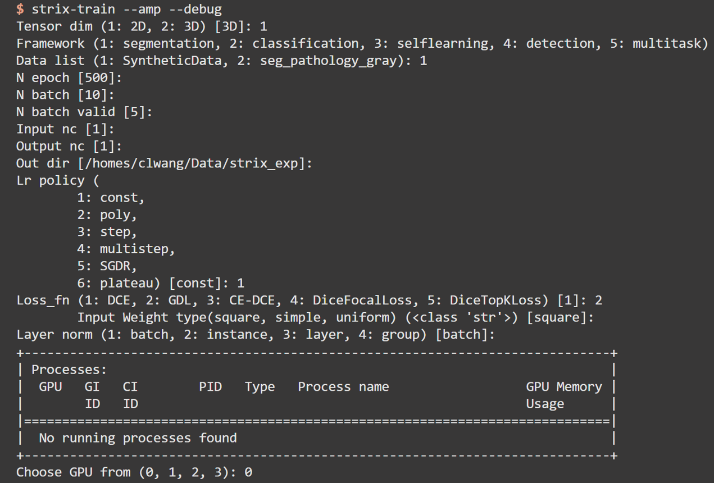

<!--
*** Thanks for checking out this README Template. If you have a suggestion that would
*** make this better, please fork the repo and create a pull request or simply open
*** an issue with the tag "enhancement".
*** Thanks again! Now go create something AMAZING! :D
*** To avoid retyping too much info. Do a search and replace for the following:
*** ChingRyu, Strix, twitter_handle, email
-->


<!-- PROJECT SHIELDS -->
<!--
*** I'm using markdown "reference style" links for readability.
*** Reference links are enclosed in brackets [ ] instead of parentheses ( ).
*** See the bottom of this document for the declaration of the reference variables
*** for contributors-url, forks-url, etc. This is an optional, concise syntax you may use.
*** https://www.markdownguide.org/basic-syntax/#reference-style-links
-->
<!-- [![Contributors][contributors-shield]][contributors-url] -->
<!-- [![Forks][forks-shield]][forks-url] -->
<!-- [![Stargazers][stars-shield]][stars-url] -->
[![MIT License][license-shield]][license-url]
[![Issues][issues-shield]][issues-url]


<!-- PROJECT LOGO -->
<br />
<p align="center">
  <a href="https://gitlab.com/ChingRyu/Strix">
    
  </a>

  <h3 align="center">Strix</h3>

  <p align="center">
    A Medical Deep Learning Platform
    <br />
    <i>Make deep-learning easier for medical problems</i>
    <br />
    <a href="https://gitlab.com/ChingRyu/Strix"><strong>Explore the docs »</strong></a>
    <br />
    <br />
    <a href="https://gitlab.com/ChingRyu/Strix">View Demo</a>
    ·
    <a href="https://gitlab.com/ChingRyu/Strix/issues">Report Bug</a>
    ·
    <a href="https://gitlab.com/ChingRyu/Strix/issues">Request Feature</a>
  </p>
</p>

<!-- ## Table of Contents

* [About the Project](#about-the-project)
  * [Built With](#built-with)
* [Getting Started](#getting-started)
  * [Prerequisites](#prerequisites)
  * [Installation](#installation)
* [Usage](#usage)
* [Roadmap](#roadmap)
* [Contributing](#contributing)
* [License](#license)
* [Contact](#contact)
* [Acknowledgements](#acknowledgements) -->

<br />

<!-- ABOUT THE PROJECT -->
# About The Project
## Motivation:
*We are trying to create a comprehensive framework to easily build medical deep-learning applications.*

- Friendly interactive interface
- Good plug and play capacity
- Various tasks support
- Easy debug & Good reproducibility

## Design Concept:
*We aim to disentangle both Data scientist & Archi Engineer, Networks & Pipelines.* \
You can easily put your own datasets and networks into Strix and run it!
- Data scientists can focus on data collection, analysis and preprocessing.
- Architecture engineers can focus on exploring network architectures.


<br />
<br />

<!-- GETTING STARTED -->
# Getting Started

### Prerequisites
Strix is powered by [Pytorch](https://pytorch.org), [MONAI](https://monai.io) and [Ignite](https://pytorch-ignite.ai).\
Strix relies heavily on following packages to make it work. Theoretically, these packages will be automatically installed via pip installation. If not, please manually install them.
* pytorch
* tb-nightly
* click
* tqdm
* numpy
* scipy
* scikit-image
* scikit-learn
* nibabel
* pytorch-ignite
* monai_ex
* utils_cw


### Installation

For developers, we suggest you to get a local copy up and install.
```
git clone https://gitlab.com/ChingRyu/Strix.git
pip install -e ./Strix
```

For users, you can just install via pip.
```
pip install git+https://gitlab.com/ChingRyu/Strix.git
```
More details please refer to [install](./install.md).


<!-- USAGE EXAMPLES -->
# Usage

_For more examples, please refer to the [Documentation](https://example.com)_

### Strix has 7 different commands: 

- `strix-train`: Main train entry. Use this command for general DL training process.
- `strix-train-from-cfg`: Begin a training process from specified configure file, usually used for reproduction.
- `strix-train-and-test`: Begin a full training&testing process automatically.
- `strix-test-from-cfg`: Begin a testing processing from specified configure file.
- `strix-nni-search`: Use [NNI](https://nni.readthedocs.io) for automatic hyper-parameter tuning. 
- `strix-check-data`: Visualize preprocessed input dataset.
- `strix-gradcam-from-cfg`: Gradcam visualization.

**Here is a usage example!**\


### How to use my own dataset & network?

- If you want use your own dataset, first you need to create a simple python script of a configuration to generate your dataset. For more details, please refer to this [readme](strix/datasets/README.md)
- If you want try your own network, you need to follow this [steps](strix/models/README.md) to easily register your network to Strix.
- After preparation, just simply put own dataset/network file into custom folder, and run!


<!-- ROADMAP -->
## Roadmap

See the [open issues](https://gitlab.com/ChingRyu/Strix/issues) for a list of proposed features (and known issues).


<!-- CONTRIBUTING -->
## Contributing

Contributions are what make the open source community such an amazing place to be learn, inspire, and create. Any contributions you make are **greatly appreciated**.

<!-- 1. Fork the Project
2. Create your Feature Branch (`git checkout -b feature/AmazingFeature`)
3. Commit your Changes (`git commit -m 'Add some AmazingFeature'`)
4. Push to the Branch (`git push origin feature/AmazingFeature`)
5. Open a Pull Request -->


<!-- LICENSE -->
## License

Distributed under the GNU GPL v3.0 License. See `LICENSE` for more information.


<!-- CONTACT -->
## Contact

Chenglong Wang - clwang@phy.ecnu.edu.cn

Project Link: [https://gitlab.com/ChingRyu/Strix](https://gitlab.com/ChingRyu/Strix)


<!-- ACKNOWLEDGEMENTS -->
## Acknowledgements


<!-- MARKDOWN LINKS & IMAGES -->
<!-- https://www.markdownguide.org/basic-syntax/#reference-style-links -->
[contributors-shield]: https://img.shields.io/github/contributors/ChingRyu/repo.svg?style=flat-square
[contributors-url]: https://gitlab.com/ChingRyu/repo/graphs/contributors
[forks-shield]: https://img.shields.io/github/forks/ChingRyu/repo.svg?style=flat-square
[forks-url]: https://gitlab.com/ChingRyu/repo/network/members
[stars-shield]: https://img.shields.io/github/stars/ChingRyu/repo.svg?style=flat-square
[stars-url]: https://gitlab.com/ChingRyu/repo/stargazers
[issues-shield]: https://img.shields.io/github/issues/ChingRyu/repo.svg?style=flat-square
[issues-url]: https://gitlab.com/ChingRyu/strix/-/issues
[license-shield]: https://img.shields.io/github/license/ChingRyu/repo.svg?style=flat-square
[license-url]: https://gitlab.com/ChingRyu/strix/-/blob/master/LICENSE
[product-screenshot]: images/screenshot.png
